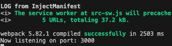

# Just Another Text Editor

Welcome to JATE, a text editor that runs in your browser! with a Progressive Web Application backend,  JATE is desgined to run in your browser and offline if need be, making it the perfect notetaking application for at home or on the go.

## Description

JATE utilizes several webpack plugins to generate HTML files, load styles and CSS that brings our application to life, and caches responses to make sure your data persists.

## Getting Started

### Dependencies

* express
* nodejs
* babel plugin
* IndexedDB
* Webpack manifest

### Installing

Installing is easier than ever. Once you open the application on your web browser, click "Install" to get started.

## Authors

Samantha Gosselin is a fullstack web developer based in Austin, Texas. You can view her work on [github](https://github.com/Samanthag2009) or connect on [linkedIn](https://www.linkedin.com/in/samantha-gosselin-37493517/)
## Version History

* 0.1
    * Initial Release

## Acknowledgments

* [awesome-readme](https://github.com/matiassingers/awesome-readme)

